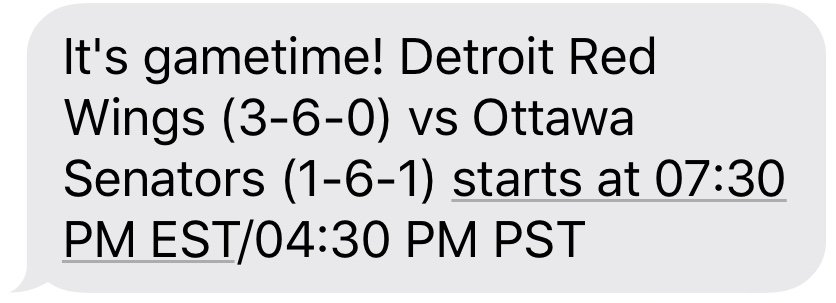

# nhl-game-notifier

By Corey Gale (`mechtrondev[at]gmail.com`)

## Features

1. NHL API integration for retrieving game schedules and team data
1. CLI tool for user management
1. Configurable notification times
1. Terraformed IaC
1. Operates within AWS's free tier (for <7 users)

### Example notification



## AWS Infrastructure

### Resources

- Lambda function triggered by CloudWatch Events
- DynamoDB table for user data
- SNS topic for SMS notifications
- CloudWatch Log Stream for Lambda function output

### Estimated cost

All of the AWS resources provisioned by this project fit within [AWS's always-free tier](https://aws.amazon.com/free/?all-free-tier.sort-by=item.additionalFields.SortRank&all-free-tier.sort-order=asc&awsf.Free%20Tier%20Types=tier%23always-free), with a single exception that is SMS messages. Within the free tier, AWS includes 100 Worldwide SMS messages per month, which should be enough to support up to 7 users. If you would like to notify additional users, you will be subjected to charges as per [AWS's Worldwide SMS Pricing](https://aws.amazon.com/sns/sms-pricing/).

To avoid bill shock, I suggest that you set up a [billing alarm](https://docs.aws.amazon.com/AmazonCloudWatch/latest/monitoring/monitor_estimated_charges_with_cloudwatch.html) for your AWS account.

## User Management

### Setup the CLI tool

1. Make sure Python 3 & Pip 3 are installed
1. Install pip dependencies: `pip3 install -r notifier/requirements.txt --user`

### List users

You can list all users using the `list` action:

	./manage_users.py --action list
	
Example output:

```	
Retrieving user list from DynamoDB..
2 users successfully loaded
+----------+-------------+-----------------------+------+--------------------------------+---------------------+
|    Id    |  SmsNumber  | SmsNumberIsSubscribed | Team | MinutesToNotifyBeforeGameStart |     LastNotified    |
+----------+-------------+-----------------------+------+--------------------------------+---------------------+
| 769d1308 | 13231234567 |          True         | DET  |               15               | 2019-10-23 16:15:00 |
| a2334dbd | 19051234567 |          True         | TOR  |               10               | 2019-10-26 15:50:00 |
+----------+-------------+-----------------------+------+--------------------------------+---------------------+
```

### Create a new user

To create new users, use the `create` action:

	./manage_users.py --action create --sms 13231234567 --team DET --notify-before-minutes 15

Where `--sms` is the user's SMS phone number, `--team` is the [3-letter abbreviation](https://en.wikipedia.org/wiki/Template:NHL_team_abbreviations) for the user's favourite NHL team and `--notify-before-minutes` is the number of minutes prior to game start time that the user would like to be notified at (must be >= 10 minutes).

Example output:
	
	New user successfully created

### Delete a user

You can also delete users using the `delete` action:

	./manage_users.py --action delete --id 769d1308

Where `--id` is the user id which can be obtained using the `list` action.

Example output:

	User with ID 769d1308 was successfully deleted

## Deployments

### Dependencies

1. `make`
1. Terraform v0.12.x
1. Terragrunt v0.20.x

### Deploy an environment

1. Update the Terragrunt values in `terraform/terragrunt/terragrunt.hcl` to match your AWS account's configuration.
1. To deploy the `prod` environment (using the Terragrunt variables stored in `terraform/terragrunt/prod/terragrunt.hcl`):

		ENV=prod TF_ACTION=apply make terragrunt

### Destroy an environment

To destroy an environment (in this case `prod`), set the `TF_ACTION` environment variable to `destroy`:

	ENV=prod TF_ACTION=destroy make terragrunt


### Creating new environments

Creating new environments is as easy as creating a new Terragrunt environment folder:

1. Copy `terraform/terragrunt/prod/terragrunt.hcl` to a new sub-directory under `terraform/terragrunt/`. The name that you choose for this directory will be your new environment's name.
1. Update the environment's name in the newly copied `terragrunt.hcl` file under the `inputs` section near the end of the file.
1. Deploy your environment with `make`:
		
		ENV=<ENV> TF_ACTION=apply make terragrunt
		
	Where `<ENV>` is your new environment's name.

## To Do

1. Add GitHub Actions deployment pipeline
